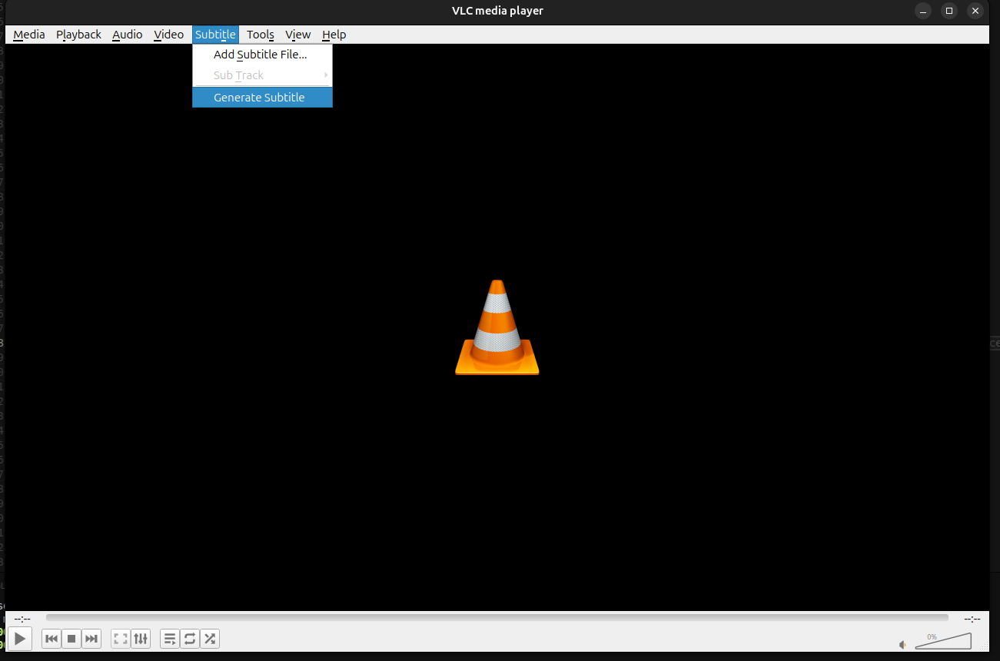

## VLC Media Player with Whisper Speech Recognition Integration

This repository contains modifications to VLC Media Player 3.0.21, integrating OpenAI's Whisper model for automatic subtitle generation.

## Credits and Acknowledgments
- VLC Media Player by [VideoLAN](https://www.videolan.org/vlc/)
- Whisper model by [OpenAI](https://openai.com/research/whisper)
- Whisper.cpp by [Georgi Gerganov](https://github.com/ggerganov/whisper.cpp)

## Features

- **Automatic Subtitle Generation**: Generate subtitles for any video
- **Real-time Processing**: Track inference latency and performance metrics
- **Multi-language Support**: Leverage Whisper's multilingual capabilities

## Video Demo

[](https://youtu.be/C6h30NUFdAc)

## Performance Metrics

- Real-Time Factor: ~0.5 (processes 1 min of audio in 30 sec on average hardware)
- Model: Whisper Tiny English
- Platform: Ubuntu x86_64

## Prerequisites

- Ubuntu 20.04+ or similar Linux distribution
- Whisper.cpp library (instructions below)
- VLC 3.0.21 build dependencies


## Architecture
```
select "Generate Subtitle"
        ↓
Extract audio with FFmpeg 
        ↓
Load Whisper model (ggml-tiny.en.bin)
        ↓
Run inference with latency tracking
        ↓
Generate SRT subtitle file
        ↓
Auto-load subtitles in VLC
```

## Performance Tracking

The implementation includes comprehensive latency tracking:
- Model loading time
- Audio extraction time
- Inference time with Real-Time Factor (RTF)
- Subtitle generation time

## Quick Start

- Download ffmpeg and place in dependencies/ffmpeg
  - expects ffmpeg, ffprobe, qt-faststart
- Build whisper for Ubuntu/Linux and place .so and .a files in dependencies/whisper
  - expects libwhisper.a, libwhisper.so,  libwhisper.so.1, libwhisper.so.1.7.5  
- Download whisper model and place in dependencies//whisper/models/
  - refer to https://github.com/ggml-org/whisper.cpp/blob/master/models/README.md

## Build Instructions

This project builds identically to VLC 3.0.21 from source, as the only 
build-relevant modification is in `modules/gui/qt/Makefile.am`, `modules/gui/qt/menus.hpp`,
and `modules/gui/qt/menus.hpp` .

Follow the official VLC build instructions for Linux:
https://wiki.videolan.org/Building_VLC/

Check the original repository 
https://github.com/videolan/vlc 

Be sure to handle required libraries/dependencies for a successful build. 

Before building, ensure the `dependencies/` folder is in place at the root 
of the build directory:
```
dependencies/
  - ffmpeg/              # static ffmpeg binary for audio extraction
  - whisper/              # Whisper tiny.en model and header files
```

The Makefile expects these paths at build time.


## Usage

1. Open a video file in VLC
2. Navigate to **Subtitle** - **Generate Subtitle**
3. Wait for processing (progress shown in console with `-vvv` flag)
4. Subtitles will automatically load when complete

## Modified Files

- `modules/gui/qt/menus.cpp` 
- `modules/gui/qt/menus.hpp` 
- `modules/gui/qt/Makefile.am` 


Enable verbose logging to see metrics:
```bash
./vlc -vvv --intf qt
```

## Limitations

- Support provided for Ubuntu only
- Currently supports English only (configurable by changing whisper model)

## License

This modification is released under the GPL-2.0 license, consistent with VLC Media Player's license.

Original VLC Media Player: https://www.videolan.org/vlc/

Whisper.cpp: https://github.com/ggerganov/whisper.cpp


## Authors
[VLC media player](https://github.com/videolan/vlc)

[OpenAI](https://openai.com/research/whisper)

[Whisper.cpp](https://github.com/ggerganov/whisper.cpp)
